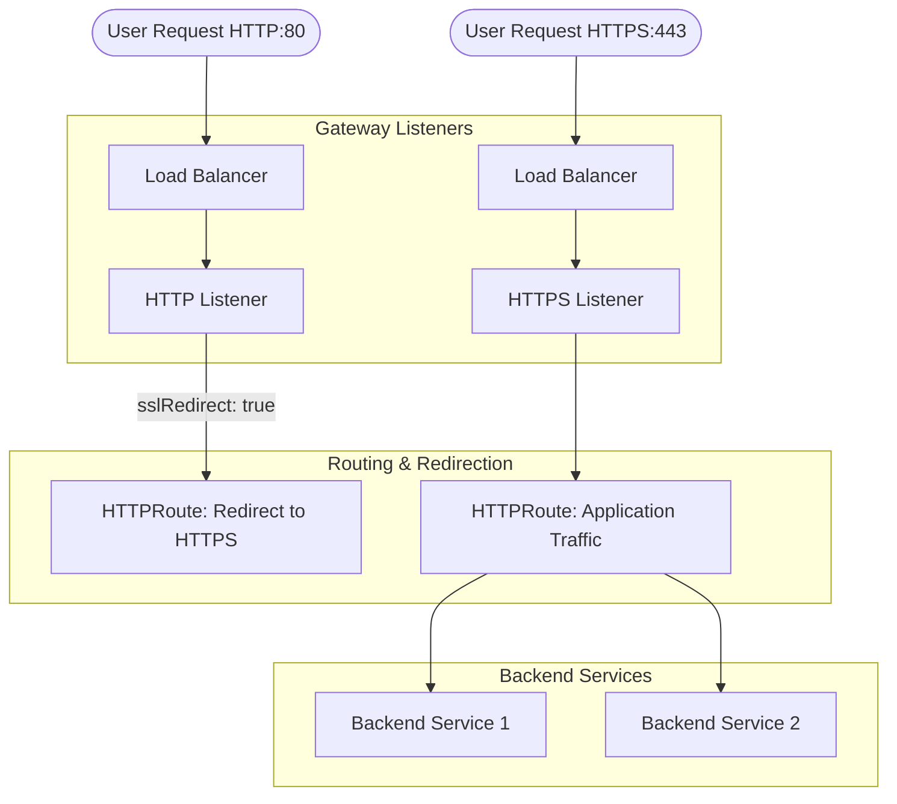

# Gateway API Implementation

This chart utilizes the **Kubernetes Gateway API**, the next generation of Kubernetes networking that enables more expressive, extensible, and role-oriented service networking compared to the legacy Ingress API.

## 🌟 Why Gateway API?

- **Role-Oriented**: Clearly separates responsibilities between Cluster Operators (managing Gateways) and Application Developers (managing Routes).
- **Expressive**: Native support for advanced routing (header matching, traffic splitting) without relying on annotations.
- **Extensible**: Designed to be extended by custom resources and filters.

## 🏗️ Prerequisites: Gateway Controller

This chart relies on a Gateway Controller to provision the underlying load balancer infrastructure. We recommend the **NGINX Gateway Fabric** as the default controller.

### Installing NGINX Gateway Controller

1.  **Install Gateway API CRDs**:
    ```bash
    kubectl apply -f https://github.com/kubernetes-sigs/gateway-api/releases/download/v1.0.0/standard-install.yaml
    ```

2.  **Install NGINX Gateway Fabric**:
    ```bash
    helm install nginx-gateway oci://ghcr.io/nginxinc/charts/nginx-gateway-fabric --create-namespace -n nginx-gateway
    ```

3.  **Verify Installation**:
    ensure the GatewayClass is available:
    ```bash
    kubectl get gatewayclass
    # Output should show 'nginx'
    ```

## 📂 Project Structure

Verified chart structure for Gateway implementation:

```
├── appsphere
│   ├── Chart.yaml
│   ├── templates
│   │   ├── app-deployments.yaml
│   │   ├── app-services.yaml
│   │   ├── gateway-client-setting.yaml
│   │   ├── gateway.yaml
│   │   ├── _helpers.tpl
│   │   ├── hpa.yaml
│   │   ├── http-redirect.yaml
│   │   ├── http-route.yaml
│   │   ├── NOTES.txt
│   │   ├── pdb.yaml
│   │   ├── rbac-sa-token.yaml
│   │   ├── rolebinding.yaml
│   │   ├── role.yaml
│   │   ├── serviceaccount.yaml
│   │   └── tests
│   │       └── test-connection.yaml
│   ├── values
│   │   ├── integration-values.yaml
│   │   ├── prod-values.yaml
│   │   └── qa-values.yaml
│   └── values.yaml
├── GATEWAY.md
└── README.md
```

## 🔄 Workflow & Architecture

The Gateway API functions through a clear hierarchy of resources:

1.  **GatewayClass**: Defines the controller implementation (e.g., `nginx`, `istio`).
2.  **Gateway**: Represents the load balancer infrastructure. It defines **Listeners** (ports and protocols).
3.  **HTTPRoute**: Defines the routing logic. It attaches to a **Gateway Listener** and forwards traffic to **Backend Services**.



## 🛠️ Setup & Configuration

Configure the Gateway in `values.yaml` under the `gateway` section.

### 1. Enable Gateway
```yaml
gateway:
  enabled: true
  name: demo-gateway
```

### 2. Define Listeners & Routes

This chart uses a centralized configuration model where routes are defined directly under their respective listeners.

```yaml
gateway:
  listeners:
    - host: api.example.com
      port: 443
      protocol: HTTPS
      tls: tls-secret-name
      sslRedirect: true      # Enables HTTP -> HTTPS redirection
      
      routes:
        - path: /v1
          pathType: PathPrefix
          backendRefs:
            - name: my-service
              port: 80
              weight: 100
```

### 3. Advanced Proxy Settings
The chart supports `ClientSettingsPolicy` (specifically for NGINX Gateway Fabric) to configure low-level proxy settings like request body size.

```yaml
gateway:
  clientSettings:
    enabled: true
    name: gateway-client-settings
    maxSize: "50"  # Set max body size (e.g., 50m)
```

### 4. Key Fields Explained

| Field | Description |
|-------|-------------|
| `host` | The hostname to listen for (e.g., `api.example.com`). Matches specific `HTTPRoutes`. |
| `tls` | Name of the Kubernetes Secret containing the TLS certificate. |
| `sslRedirect` | Boolean. If true, traffic on port 80 for this host is redirected to HTTPS. |
| `clientSettings` | Configuration for `ClientSettingsPolicy` (e.g., `maxSize` for body size). |
| `routes` | List of routing rules attached to this listener. |
| `path` | URL path to match (e.g., `/api`). |
| `backendRefs` | List of backend services and their weights (used for Blue-Green/Canary). |
| `backendRefs[].name` | Name of the Kubernetes Service to forward traffic to (must match `app.name`, or `app.name-blue`/`app.name-green`). |

## ✅ Verification

After deployment, verify the Gateway status:

```bash
# Check if Gateway is programmed and ready
kubectl get gateway -n <namespace>

# Check if HTTPRoutes are accepted
kubectl get httproute -n <namespace>
```
